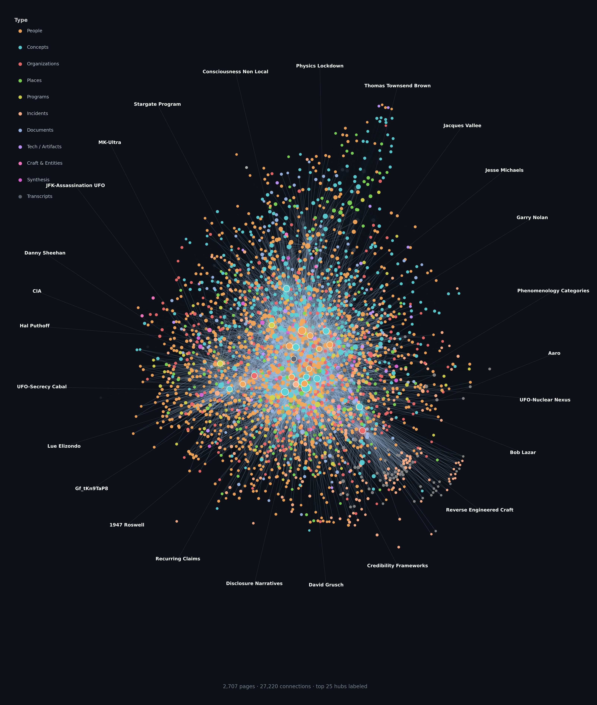

# UFO/UAP Knowledge Base

A connected wiki of the UFO/UAP discourse. **2,584 pages, ~27,200 connections, growing.**

<p align="center">
  
  <br>
  <sub><i>The full graph: every page is a node, every <code>[[wikilink]]</code> an edge. Top hubs (CIA, Hal Puthoff, Jacques Vallée, MK-Ultra, JFK-assassination/UFO, …) glow at the centre; the long tail fans out around them.</i></sub>
</p>

The goal: map *who is who, where things happened, what concepts recur, and how they all link* across a fragmented field whose sources rarely cite each other directly. Most UFO content lives in long podcasts, books, and obscure documents that never connect to one another. This KB does the connecting.

## What's in here

| | Count |
|---|---|
| People (witnesses, researchers, officials, contactees, journalists) | 1,050 |
| Concepts & frameworks (claim-thesis pages, disclosure-narratives, etc.) | 438 |
| Organizations (agencies, programs, occult orders, media) | 273 |
| Incidents (sightings, hearings, leaks, public events) | 225 |
| Places (bases, incident sites, regions) | 141 |
| Documents — entities (FOIA, books, memos, leaks) | 111 |
| Programs (AAWSAP, Stargate, MK-Ultra, ATIP, …) | 86 |
| Tech artifacts (alleged materials, patents, implants) | 38 |
| Craft & entity phenomena (Tic-Tac, Greys, Mantids, …) | 18 |
| Symbols & glyphs | 3 |
| Synthesis pages (cross-source comparisons, gap analyses) | 13 |
| Source summaries — YouTube transcripts | 124 |
| Source summaries — government release documents | 69 |
| Raw YouTube transcripts | 129 |

Every page lives in `ufo-kb/wiki/` as plain Markdown with structured YAML frontmatter and `[[wikilinks]]` between pages. Every claim cites its raw source in `ufo-kb/raw/`.

## How to read it

You don't need any tooling to browse — the wiki is plain Markdown.

- Open `ufo-kb/CONSTITUTION.md` first to understand the schema (entity types, connection rules, naming conventions).
- Browse pages directly:
  - `ufo-kb/wiki/entities/people/` — individuals
  - `ufo-kb/wiki/concepts/` — recurring claims and analytical lenses
  - `ufo-kb/wiki/synthesis/` — curated cross-source analyses (start here for the high-leverage stuff)
  - `ufo-kb/wiki/youtube-transcripts/` — per-source summaries with claim extraction (podcasts, interviews)
  - `ufo-kb/wiki/documents/` — per-source summaries for government-released documents, books, articles
- Tools like [Obsidian](https://obsidian.md/) render the wikilinks natively — point a vault at `ufo-kb/wiki/` for a navigable graph view.

## How to query it (Claude Code)

This repo ships with three Claude Code skills that together let an LLM walk the graph and answer questions with sentence-level path-as-citation grounding.

**Setup:**

1. Install [Claude Code](https://www.anthropic.com/claude-code).
2. Install [`qmd`](https://github.com/tobi/qmd) (the embeddings index used for cold seed-finding):
   ```bash
   pip install qmd
   ```
3. Build the search index:
   ```bash
   cd ufo-kb
   qmd update --collections ufo-kb
   qmd embed
   ```
4. Open the project in Claude Code:
   ```bash
   cd ufo-kb
   claude
   ```
5. Ask a question. Claude auto-loads the right skill:
   - `/kb-query "How does Lue Elizondo connect to the Skinwalker Ranch lineage?"` — relational
   - `/kb-query "Compare Garry Nolan, James Lacatski, and Hal Puthoff"` — comparison
   - `/kb-query "What don't we know about Project Stargate?"` — gap analysis
   - `/kb-query "What do we know about Lockheed Skunk Works?"` — factoid

The query skill returns answers as **traced paths** — `[[A]] → [[B]] → [[C]]` with the actual line on each predecessor page where the link appears, so you can verify every claim.

## How to contribute (Claude Code)

Two skills handle ingestion and maintenance:

- `/kb-import` — stage a new YouTube transcript, article, book excerpt, or document **outside** `ufo-kb/` (use `transcripts/` for YouTube — see below — or any path you control for other source types), then invoke `/kb-import <path>`. The skill moves the raw file into the correct `ufo-kb/raw/<type>/` subdirectory itself; you don't place it there manually. From there it pulls graph context, creates/updates pages with alias-aware deduplication, predicts non-obvious connections via graph algorithms (Jaccard / Adamic-Adar / common-neighbors), auto-applies safe back-links, runs the audit at the boundary, and syncs the search index.
- `/kb-maintain` — audit pass over the whole graph. Surfaces orphans, duplicates, dangling links, broken synthesis, hub-split candidates. Two safe auto-fix categories (synthesis back-links + exact-alias dangling rewrites) apply with `--apply`; everything else is flagged for human triage with concrete evidence.

Both skills enforce the rules in `ufo-kb/CONSTITUTION.md` — the spec the wiki is built against. Edits must satisfy it before sync.

### Import a YouTube video

`scripts/youtube_import.py` is the canonical entry point for adding a new YouTube transcript. It downloads captions, cleans them, prefills metadata frontmatter from `yt-dlp`, and stages the file in `transcripts/` (gitignored) for `/kb-import` to consume.

**One-time setup:**

```bash
pip install -r requirements.txt          # installs yt-dlp + qmd
```

**Single video:**

```bash
python scripts/youtube_import.py fetch https://www.youtube.com/watch?v=<id>
# or just the bare ID:
python scripts/youtube_import.py fetch <id>
# IDs starting with `-` need the argparse sentinel:
python scripts/youtube_import.py fetch -- -0g3lLGxNfc
```

The helper:
- Refuses if the video ID is in `ufo-kb/imports/off-topic-skipped.md`.
- Refuses if the file already exists in `transcripts/`, `ufo-kb/raw/youtube-transcripts/`, or `ufo-kb/wiki/youtube-transcripts/` (use `--force` to overwrite).
- Tries manually-uploaded English captions first, falls back to auto-generated.
- Writes `transcripts/<id>.md` with `video_id`, `title`, `channel`, `published`, `url`, `duration_minutes` prefilled — `/kb-import` should copy these verbatim rather than re-deriving from the transcript body.

Then in Claude Code:

```
/kb-import transcripts/<id>.md - YouTube Transcript
```

**Many videos at once:**

```bash
# From a YouTube playlist URL:
python scripts/youtube_import.py fetch --batch "https://www.youtube.com/playlist?list=..."

# From a text file (one URL/ID per line; blank lines + `#`-comments skipped):
python scripts/youtube_import.py fetch --batch my-queue.txt
```

After staging, run `/kb-import` for each transcript. The helper has a built-in batch driver:

```bash
python scripts/youtube_import.py run-imports
```

This invokes `/kb-import` on every file in `transcripts/`, runs `/kb-maintain` periodically, and **reuses one Claude session** across all calls (via `--session-id` + `--resume`) so the model context — skill prompts, graph state, prior import work — is cached across files instead of being reloaded each time. Failures retry up to 3×; progress is checkpointed in `import_log.json` so you can interrupt and resume. Use `--reset` to wipe and start over, `--retry-failed` to re-attempt previously-failed files, or `--new-session` to force a fresh Claude session.

**Cleanup utility:**

```bash
python scripts/youtube_import.py clean <transcripts/file.md>
```

Collapses any VTT-residue blank lines in an already-staged file. Most users won't need this — `fetch` produces cleaned output.

## Structure

```
ufo-knowledge-base/
├── README.md              ← you are here
├── LICENSE                ← CC-BY-SA-4.0 on derived work; raw sources retain original copyright
├── ufo-kb/
│   ├── CONSTITUTION.md    ← schema spec
│   ├── imports/           ← per-procedure import rules (one per source type)
│   ├── wiki/              ← the knowledge base (Markdown)
│   │   ├── entities/      ← people / orgs / places / programs / incidents / docs / tech / craft / symbols
│   │   ├── concepts/      ← claims-theses, disclosure-narratives, credibility-frameworks, etc.
│   │   ├── synthesis/     ← cross-source comparisons & gap analyses
│   │   ├── youtube-transcripts/   ← per-source claim summaries (podcasts, interviews)
│   │   └── documents/     ← per-source claim summaries (gov-release docs, books, articles)
│   └── raw/               ← original source files (transcripts, articles, scanned docs)
├── .claude/skills/        ← Claude Code skills
│   ├── kb-import/         ← source-in pipeline
│   ├── kb-query/          ← graph walker for question-answering
│   ├── kb-maintain/       ← audit + auto-fix
│   └── kb-evolve/         ← schema/rule changes (rare)
├── docs/
│   └── graph.png          ← the hero graph rendered above
├── scripts/
│   ├── youtube_import.py  ← fetch + batch + run-imports + clean
│   └── graph_viz/         ← build_graph.py + render_graph.py for the README image
└── requirements.txt       ← yt-dlp, qmd
```

## Regenerate the graph image

The hero image at the top is produced by two scripts in `scripts/graph_viz/`:

```bash
pip install matplotlib networkx numpy
python scripts/graph_viz/build_graph.py     # walks ufo-kb/wiki/, parses [[wikilinks]] → graph.json
python scripts/graph_viz/render_graph.py    # force-directed layout, hub halos, ring labels → docs/graph.png
```

The layout is cached at `scripts/graph_viz/layout.npz`; delete it to recompute. `--help` on the renderer exposes knobs for size, DPI, label count, edge weight, etc.

## Design principles

The skills enforce a small set of load-bearing rules that took many iterations to converge on:

- **Embeddings to enter, graph to ground.** Vector search (qmd) is allowed *only* for cold seed-finding when no slug/alias resolves. Once on the graph, traversal is the sole grounding mechanism. No mid-walk semantic shortcuts.
- **Every claim cites a path.** Answers don't paraphrase — they trace `[[A]] → [[B]] → [[C]]` and quote the line on each page where the link appears.
- **Anecdotes are the evidence.** Interview/testimony sources are extracted as concrete-evidence bullets (named anecdotes, direct quotes, specific dates/places/people), not abstracted into concept claims. The "Headline Claims" section records specific events, not philosophical generalizations.
- **Wikilink only what's worth a page.** A `[[wikilink]]` is a commitment that the target either is or should become a node. Tangential mentions stay plain text.
- **Auto-fix only what the schema mandates.** Synthesis back-links and exact-alias dangling rewrites are constitution-derived. Everything else (merges, splits, fuzzy rewrites) requires human approval.
- **A graph-grounded "I can't" beats a hallucinated "I can".** When a walk hits a dead end, the answer reports the gap.

These rules live in the SKILL.md files under `.claude/skills/`. Read them if you want to understand why the KB looks the way it does.

## A note on the source material

The KB covers UFO/UAP discourse and its adjacents (consciousness research, intelligence community, paranormal, NHI, ancient mysteries, government secrecy programs). The framing is **mapping the discourse, not adjudicating truth**. Many pages document claims that are contested, unverified, or actively disputed — the wiki reflects the contest rather than picking winners. Where two sources disagree, the contradiction is flagged with `> ⚠ Conflict:` rather than silently resolved.

If you're looking for either confirmation or debunking, this isn't that project. It's a connection-finding instrument.

## Contributing

This is a personal sense-making project, not a multi-author wiki. PRs are welcome. If you spot a factual error, a misattribution, or want a raw source removed, open an issue.

## License

CC-BY-SA-4.0 on the wiki, synthesis pages, constitution, skills, and tooling. Raw source material in `ufo-kb/raw/` retains its original copyright. See `LICENSE` for details.
